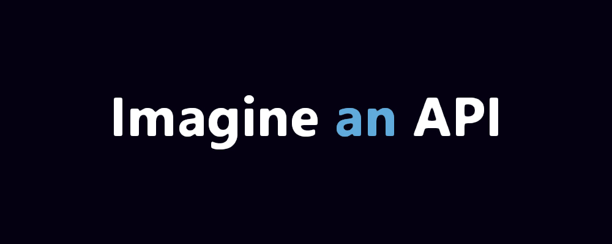

## Getting Started

**easy-api.ts** is a lightweight framework for building APIs using a simple string-based DSL while leveraging the performance and reliability of Fastify under the hood.

Whether you're creating small projects, prototypes, or production-ready APIs, easy-api.ts allows you to focus on your application logic without dealing with complex backend boilerplate.

## Features

* 📝 Beginner-friendly syntax.
* ⚡ Fast and lightweight.
* 🚀 Built on top of Fastify.
* 🔥 Built-in image manipulation functions.
* 📚 Regular updates and improvements.
* 🎯 Designed for rapid API development.

## Requirements

Before getting started, make sure you have:

* Basic knowledge of JavaScript.
* Node.js installed on your machine.
* A package manager such as npm, pnpm, or yarn.

## Installation

```bash
npm install easy-api.ts
```

## Basic Setup

Create a new file named `index.js`:

```js
const { API } = require("easy-api.ts");

const api = new API({
    dots: false,
    reverse: false,
});

api.route({
    url: "/hello",
    method: "get",
    code: `
        $reply[
            $setCode[200]
            $setType[json]
            $setBody[{
                "hello": "world"
            }]
        ]
    `,
});

api.connect({
    host: "localhost",
    port: 3000,
});
```

Start your application and visit:

```txt
http://localhost:3000/hello
```

Response:

```json
{
    "hello": "world"
}
```
